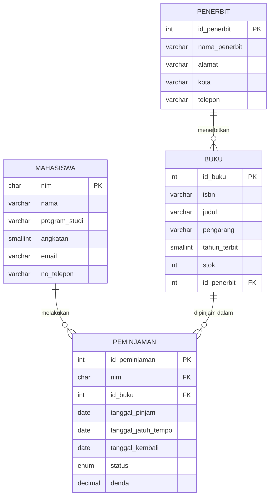

# Tugas Mandiri Module 6 - Perancangan ERD E-Library Kampus

**Nama:** Efraim Imanuel Parasak
**NIM:** D121241062
**Mata Kuliah:** Pemrograman Web
**Program Studi:** Teknik Informatika, Universitas Hasanuddin

---

## 1. Skenario

Perpustakaan kampus ingin mengganti pencatatan peminjaman buku yang selama ini manual dengan sistem basis data relasional. Sistem harus bisa mencatat:

- data **mahasiswa** yang meminjam,
- data **buku** yang tersedia,
- data **penerbit** dari tiap buku,
- **riwayat peminjaman dan pengembalian** buku.

Dokumen ini berisi rancangan ERD logis, identifikasi atribut beserta kuncinya, simulasi normalisasi (UNF → 1NF → 2NF → 3NF), rancangan tabel akhir, dan diagram relasi.

### Asumsi yang saya pakai

1. Satu baris transaksi peminjaman mewakili **satu mahasiswa meminjam satu judul buku** pada satu waktu. Kalau meminjam dua buku, tercatat dua transaksi.
2. Satu buku diterbitkan oleh **satu penerbit**, sedangkan satu penerbit bisa menerbitkan banyak buku.
3. Lama peminjaman standar adalah 7 hari. Keterlambatan dikenai denda per hari.
4. Pengarang saya simpan sebagai satu kolom teks di tabel `buku` supaya rancangan tetap sederhana dan sesuai empat entitas yang diminta.

---

## 2. Identifikasi Entitas dan Atribut

### 2.1 Penerbit
| Atribut | Keterangan | Kunci |
|---|---|---|
| id_penerbit | Identitas unik penerbit | **PK** |
| nama_penerbit | Nama penerbit | |
| alamat | Alamat penerbit | |
| kota | Kota penerbit | |
| telepon | Nomor telepon penerbit | |

### 2.2 Mahasiswa
| Atribut | Keterangan | Kunci |
|---|---|---|
| nim | Nomor induk mahasiswa | **PK** |
| nama | Nama lengkap | |
| program_studi | Program studi | |
| angkatan | Tahun masuk | |
| email | Email mahasiswa | |
| no_telepon | Nomor telepon | |

### 2.3 Buku
| Atribut | Keterangan | Kunci |
|---|---|---|
| id_buku | Identitas unik buku | **PK** |
| isbn | Nomor ISBN | (unik) |
| judul | Judul buku | |
| pengarang | Nama pengarang | |
| tahun_terbit | Tahun terbit | |
| stok | Jumlah eksemplar tersedia | |
| id_penerbit | Penerbit buku | **FK** → penerbit |

### 2.4 Peminjaman (Transaksi Peminjaman)
| Atribut | Keterangan | Kunci |
|---|---|---|
| id_peminjaman | Identitas unik transaksi | **PK** |
| nim | Mahasiswa yang meminjam | **FK** → mahasiswa |
| id_buku | Buku yang dipinjam | **FK** → buku |
| tanggal_pinjam | Tanggal buku dipinjam | |
| tanggal_jatuh_tempo | Batas pengembalian | |
| tanggal_kembali | Tanggal buku dikembalikan (kosong jika belum) | |
| status | `dipinjam` / `dikembalikan` / `terlambat` | |
| denda | Denda keterlambatan (Rp) | |

### 2.5 Kardinalitas Relasi

| Relasi | Kardinalitas | Penjelasan |
|---|---|---|
| Penerbit – Buku | 1 : N | Satu penerbit menerbitkan banyak buku, satu buku punya satu penerbit |
| Mahasiswa – Peminjaman | 1 : N | Satu mahasiswa bisa melakukan banyak peminjaman |
| Buku – Peminjaman | 1 : N | Satu buku bisa dipinjam berkali-kali (di waktu berbeda) |

Secara konsep, Mahasiswa dan Buku berhubungan **many-to-many**, dan tabel `peminjaman` berperan sebagai tabel penghubung sekaligus menyimpan atribut transaksinya.

---

## 3. Simulasi Normalisasi

### 3.1 UNF (Unnormalized Form)

Awalnya, data riwayat peminjaman saya bayangkan dicatat per mahasiswa, sehingga satu mahasiswa punya beberapa peminjaman dalam satu baris (*repeating group*).

| nim | nama | program_studi | riwayat_peminjaman (kode_buku, judul, pengarang, penerbit, kota_penerbit, tgl_pinjam, tgl_kembali) |
|---|---|---|---|
| D121241001 | Andi Pratama | Teknik Informatika | (B01, Basis Data, Silberschatz, McGraw-Hill, New York, 2026-09-01, 2026-09-06), (B02, Algoritma, Cormen, MIT Press, Cambridge, 2026-09-10, 2026-09-15) |
| D121241002 | Siti Rahma | Sistem Informasi | (B01, Basis Data, Silberschatz, McGraw-Hill, New York, 2026-09-03, 2026-09-09) |
| D121241003 | Budi Santoso | Teknik Informatika | (B03, Jaringan Komputer, Tanenbaum, Pearson, Boston, 2026-09-05, NULL) |

**Masalah:** kolom `riwayat_peminjaman` berisi banyak nilai sekaligus (tidak atomik) sehingga sulit dicari dan diperbarui.

### 3.2 Bentuk Normal Pertama (1NF)

**Aturan:** semua kolom atomik dan tidak ada kelompok berulang. Caranya, setiap peminjaman dijadikan satu baris sendiri.

**Primary key sementara:** `(nim, kode_buku, tgl_pinjam)`

| nim | nama | program_studi | kode_buku | judul | pengarang | penerbit | kota_penerbit | tgl_pinjam | tgl_kembali |
|---|---|---|---|---|---|---|---|---|---|
| D121241001 | Andi Pratama | Teknik Informatika | B01 | Basis Data | Silberschatz | McGraw-Hill | New York | 2026-09-01 | 2026-09-06 |
| D121241001 | Andi Pratama | Teknik Informatika | B02 | Algoritma | Cormen | MIT Press | Cambridge | 2026-09-10 | 2026-09-15 |
| D121241002 | Siti Rahma | Sistem Informasi | B01 | Basis Data | Silberschatz | McGraw-Hill | New York | 2026-09-03 | 2026-09-09 |
| D121241003 | Budi Santoso | Teknik Informatika | B03 | Jaringan Komputer | Tanenbaum | Pearson | Boston | 2026-09-05 | NULL |

**Masalah yang masih ada:** data mahasiswa dan data buku berulang (redundansi). Contoh: "Andi Pratama" tertulis dua kali dan "Basis Data" tertulis dua kali.

### 3.3 Bentuk Normal Kedua (2NF)

**Aturan:** sudah 1NF dan tidak ada *partial dependency*, yaitu atribut non-kunci yang hanya bergantung pada sebagian dari primary key gabungan.

Analisis ketergantungan fungsional terhadap PK `(nim, kode_buku, tgl_pinjam)`:

- `nim` → `nama`, `program_studi` *(bergantung sebagian pada nim)*
- `kode_buku` → `judul`, `pengarang`, `penerbit`, `kota_penerbit` *(bergantung sebagian pada kode_buku)*
- `(nim, kode_buku, tgl_pinjam)` → `tgl_kembali` *(bergantung penuh)*

Maka tabel dipecah menjadi tiga:

**Mahasiswa** — PK: `nim`

| nim | nama | program_studi |
|---|---|---|
| D121241001 | Andi Pratama | Teknik Informatika |
| D121241002 | Siti Rahma | Sistem Informasi |
| D121241003 | Budi Santoso | Teknik Informatika |

**Buku** — PK: `kode_buku`

| kode_buku | judul | pengarang | penerbit | kota_penerbit |
|---|---|---|---|---|
| B01 | Basis Data | Silberschatz | McGraw-Hill | New York |
| B02 | Algoritma | Cormen | MIT Press | Cambridge |
| B03 | Jaringan Komputer | Tanenbaum | Pearson | Boston |

**Peminjaman** — PK: `(nim, kode_buku, tgl_pinjam)`, FK: `nim`, `kode_buku`

| nim | kode_buku | tgl_pinjam | tgl_kembali |
|---|---|---|---|
| D121241001 | B01 | 2026-09-01 | 2026-09-06 |
| D121241001 | B02 | 2026-09-10 | 2026-09-15 |
| D121241002 | B01 | 2026-09-03 | 2026-09-09 |
| D121241003 | B03 | 2026-09-05 | NULL |

**Masalah yang masih ada:** di tabel Buku, `kota_penerbit` sebenarnya ditentukan oleh `penerbit`, bukan langsung oleh `kode_buku`.

### 3.4 Bentuk Normal Ketiga (3NF)

**Aturan:** sudah 2NF dan tidak ada *transitive dependency*, yaitu atribut non-kunci yang bergantung pada atribut non-kunci lain.

Ketergantungan transitif yang ditemukan:

```
kode_buku → penerbit → kota_penerbit
```

`kota_penerbit` bergantung pada `penerbit`, dan `penerbit` bergantung pada `kode_buku`. Solusinya, data penerbit dipisah ke tabel sendiri dan Buku hanya menyimpan kunci tamunya (`id_penerbit`).

**Penerbit** — PK: `id_penerbit`

| id_penerbit | nama_penerbit | kota |
|---|---|---|
| 1 | McGraw-Hill | New York |
| 2 | MIT Press | Cambridge |
| 3 | Pearson | Boston |

**Buku** — PK: `kode_buku`, FK: `id_penerbit`

| kode_buku | judul | pengarang | id_penerbit |
|---|---|---|---|
| B01 | Basis Data | Silberschatz | 1 |
| B02 | Algoritma | Cormen | 2 |
| B03 | Jaringan Komputer | Tanenbaum | 3 |

Tabel **Mahasiswa** dan **Peminjaman** tidak berubah karena sudah memenuhi 3NF.

### 3.5 Penyempurnaan pada Rancangan Akhir

Ada beberapa penyesuaian kecil agar rancangan siap diimplementasikan:

1. Tabel `peminjaman` diberi **surrogate key** `id_peminjaman` (auto increment) supaya PK lebih ringkas dibanding kunci gabungan tiga kolom. Ini tidak melanggar 3NF.
2. Kolom `kode_buku` diganti nama menjadi `id_buku` agar penamaan kunci konsisten (`id_penerbit`, `id_buku`).
3. Ditambahkan atribut pendukung (`isbn`, `stok`, `email`, `status`, `denda`, dll.) sesuai kebutuhan sistem.
4. Kolom `denda` disimpan sebagai riwayat nilai saat buku dikembalikan, supaya tidak berubah kalau tarif denda diubah di kemudian hari.

---

# 4. Rancangan Tabel Akhir

### 4.1 Tabel `penerbit`

| Kolom | Tipe Data | Kunci | Constraint | Keterangan |
|---|---|---|---|---|
| id_penerbit | INT | PK | AUTO_INCREMENT | Identitas penerbit |
| nama_penerbit | VARCHAR(100) | | NOT NULL | Nama penerbit |
| alamat | VARCHAR(255) | | NULL | Alamat penerbit |
| kota | VARCHAR(50) | | NULL | Kota penerbit |
| telepon | VARCHAR(20) | | NULL | Nomor telepon |

### 4.2 Tabel `mahasiswa`

| Kolom | Tipe Data | Kunci | Constraint | Keterangan |
|---|---|---|---|---|
| nim | CHAR(10) | PK | NOT NULL | Nomor induk mahasiswa |
| nama | VARCHAR(100) | | NOT NULL | Nama lengkap |
| program_studi | VARCHAR(50) | | NOT NULL | Program studi |
| angkatan | SMALLINT | | NOT NULL | Tahun masuk |
| email | VARCHAR(100) | | UNIQUE | Email mahasiswa |
| no_telepon | VARCHAR(20) | | NULL | Nomor telepon |

### 4.3 Tabel `buku`

| Kolom | Tipe Data | Kunci | Constraint | Keterangan |
|---|---|---|---|---|
| id_buku | INT | PK | AUTO_INCREMENT | Identitas buku |
| isbn | VARCHAR(20) | | UNIQUE, NOT NULL | Nomor ISBN |
| judul | VARCHAR(200) | | NOT NULL | Judul buku |
| pengarang | VARCHAR(100) | | NOT NULL | Nama pengarang |
| tahun_terbit | SMALLINT | | NULL | Tahun terbit |
| stok | INT | | NOT NULL, DEFAULT 0 | Jumlah eksemplar tersedia |
| id_penerbit | INT | FK | NOT NULL | Mengacu ke `penerbit.id_penerbit` |

### 4.4 Tabel `peminjaman`

| Kolom | Tipe Data | Kunci | Constraint | Keterangan |
|---|---|---|---|---|
| id_peminjaman | INT | PK | AUTO_INCREMENT | Identitas transaksi |
| nim | CHAR(10) | FK | NOT NULL | Mengacu ke `mahasiswa.nim` |
| id_buku | INT | FK | NOT NULL | Mengacu ke `buku.id_buku` |
| tanggal_pinjam | DATE | | NOT NULL | Tanggal peminjaman |
| tanggal_jatuh_tempo | DATE | | NOT NULL | Batas pengembalian |
| tanggal_kembali | DATE | | NULL | Kosong jika belum dikembalikan |
| status | ENUM('dipinjam','dikembalikan','terlambat') | | NOT NULL, DEFAULT 'dipinjam' | Status transaksi |
| denda | DECIMAL(10,2) | | NOT NULL, DEFAULT 0 | Denda keterlambatan (Rp) |

---

## 5. Visualisasi Relasi (Diagram Mermaid)



### Diagram alur teks (alternatif)

```
PENERBIT (id_penerbit)
    │ 1
    │
    │ N
BUKU (id_buku, id_penerbit*)
    │ 1
    │
    │ N
PEMINJAMAN (id_peminjaman, nim*, id_buku*)
    │ N
    │
    │ 1
MAHASISWA (nim)

Keterangan: * = Foreign Key
```

---

## 6. Implementasi SQL (MySQL)

Skrip ini saya sertakan untuk memastikan rancangan di atas benar-benar bisa dibuat tanpa galat.

```sql
CREATE DATABASE IF NOT EXISTS e_library_kampus;
USE e_library_kampus;

CREATE TABLE penerbit (
    id_penerbit   INT AUTO_INCREMENT PRIMARY KEY,
    nama_penerbit VARCHAR(100) NOT NULL,
    alamat        VARCHAR(255),
    kota          VARCHAR(50),
    telepon       VARCHAR(20)
);

CREATE TABLE mahasiswa (
    nim           CHAR(10) PRIMARY KEY,
    nama          VARCHAR(100) NOT NULL,
    program_studi VARCHAR(50)  NOT NULL,
    angkatan      SMALLINT     NOT NULL,
    email         VARCHAR(100) UNIQUE,
    no_telepon    VARCHAR(20)
);

CREATE TABLE buku (
    id_buku      INT AUTO_INCREMENT PRIMARY KEY,
    isbn         VARCHAR(20)  NOT NULL UNIQUE,
    judul        VARCHAR(200) NOT NULL,
    pengarang    VARCHAR(100) NOT NULL,
    tahun_terbit SMALLINT,
    stok         INT NOT NULL DEFAULT 0,
    id_penerbit  INT NOT NULL,
    CONSTRAINT fk_buku_penerbit
        FOREIGN KEY (id_penerbit) REFERENCES penerbit (id_penerbit)
        ON UPDATE CASCADE
        ON DELETE RESTRICT
);

CREATE TABLE peminjaman (
    id_peminjaman       INT AUTO_INCREMENT PRIMARY KEY,
    nim                 CHAR(10) NOT NULL,
    id_buku             INT NOT NULL,
    tanggal_pinjam      DATE NOT NULL,
    tanggal_jatuh_tempo DATE NOT NULL,
    tanggal_kembali     DATE NULL,
    status              ENUM('dipinjam', 'dikembalikan', 'terlambat')
                        NOT NULL DEFAULT 'dipinjam',
    denda               DECIMAL(10,2) NOT NULL DEFAULT 0,
    CONSTRAINT fk_peminjaman_mahasiswa
        FOREIGN KEY (nim) REFERENCES mahasiswa (nim)
        ON UPDATE CASCADE
        ON DELETE RESTRICT,
    CONSTRAINT fk_peminjaman_buku
        FOREIGN KEY (id_buku) REFERENCES buku (id_buku)
        ON UPDATE CASCADE
        ON DELETE RESTRICT
);
```